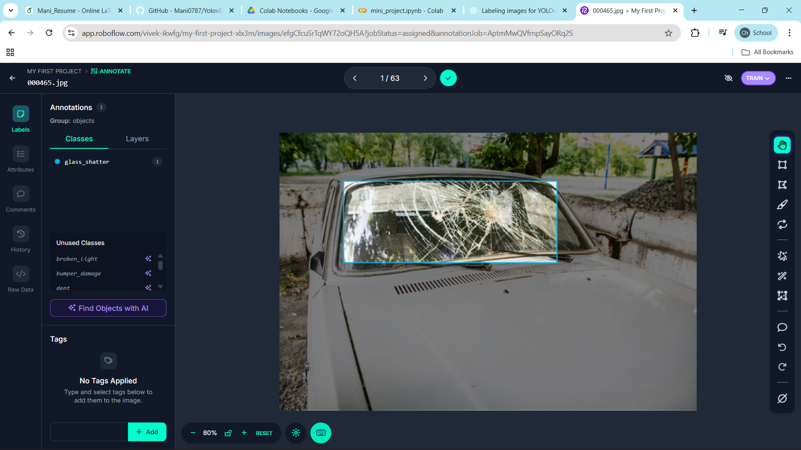
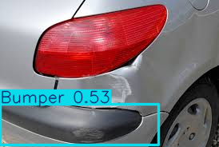

# Vehicle Damage Detection Using YOLOv Models  
### Mini Project | Computer Vision | Object Detection

---

## Overview

This project focuses on detecting various types of vehicle damage using **YOLOv-series object detection models**. The system is designed to automatically identify and classify damage on cars such as:

- **Glass Shatter**
- **Broken Light**
- **Bumper Damage**
- **Dent**

This automation can assist **insurance agencies, repair centers, police departments, and smart transport systems** by reducing manual inspection time and providing fast and accurate results.

---

## Model Used

We experimented with multiple **YOLOv versions** (YOLOv5/YOLOv7/YOLOv8/YOLOv11 depending on iteration) to determine:

- Model accuracy  
- Inference speed  
- Real-world applicability  

---

## Dataset

The dataset consists of images of damaged vehicles manually annotated using **Roboflow**.

### Sample Annotated Image:

> *Example showing bounding box annotation for `glass_shatter` damage.*

---

## Tools & Libraries Used

| Component | Technology |
|----------|------------|
| Annotation | Roboflow |
| Model Training | YOLOv (PyTorch / Ultralytics) |
| Programming Language | Python |
| Frameworks | OpenCV, NumPy, Torch |
| Deployment Format | Notebook (.ipynb) / Exported Model |

### Result:

> *Example showing bounding box annotation for `Bumper` damage.*
